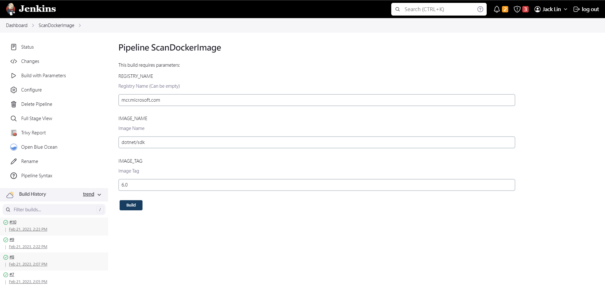
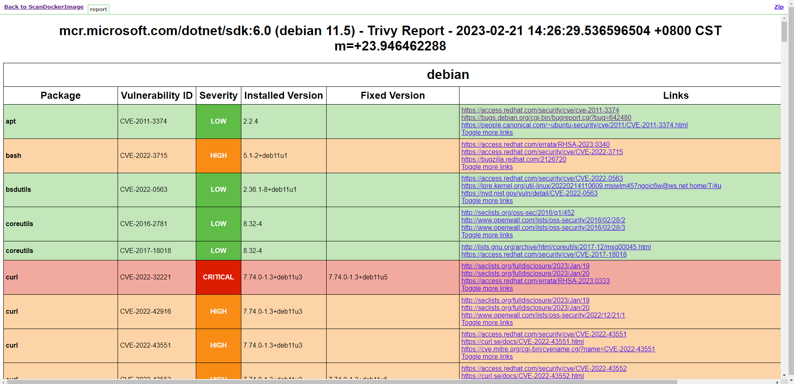

# trivy-jenkins

An Jenkins Pipeline that generates and publishes trivy reports in HTML. You can simply create a new pipeline project on Jenkins and paste the belowing code to the pipeline. Please replace `/usr/local/share/trivy/templates/html.tpl` with your template path on your server.

```groovy
pipeline {
  agent any
  parameters {
    string(name: 'REGISTRY_NAME', defaultValue: '', description: 'Registry Name (Can be empty)')
    string(name: 'IMAGE_NAME', defaultValue: '', description: 'Image Name')
    string(name: 'IMAGE_TAG', defaultValue: '', description: 'Image Tag')
  }
  stages {
    stage('Scan Docker Image') {
      steps {
        script {
          def formatOption = "--format template --template \"@/usr/local/share/trivy/templates/html.tpl\""
          def imageFullName = null
          if (params.REGISTRY_NAME == '') {
            imageFullName = "$IMAGE_NAME:$IMAGE_TAG"
          } else {
            imageFullName = "$REGISTRY_NAME/$IMAGE_NAME:$IMAGE_TAG"
          }
          sh """
            trivy image $imageFullName $formatOption --timeout 10m --output report.html || true
          """
        }

        publishHTML(target: [
          allowMissing: true,
          alwaysLinkToLastBuild: false,
          keepAll: true,
          reportDir: ".",
          reportFiles: "report.html",
          reportName: "Trivy Report",
        ])
      }
    }
  }
}
```

In the following image, I create a pipeline project called `ScanDockerImage` and paste the sample code to it. After initializing the pipeline project, there will be three inputs for me to choose an image to scan. I take `mcr.microsoft.com/dotnet/sdk:6.0` as an example and click **Build** button to start scanning.



After scanning, click **Trivy Report** tab on the left side to view the result.



**note:** you may need to enable `hudson.model.DirectoryBrowserSupport.CSP` to enable CSS.